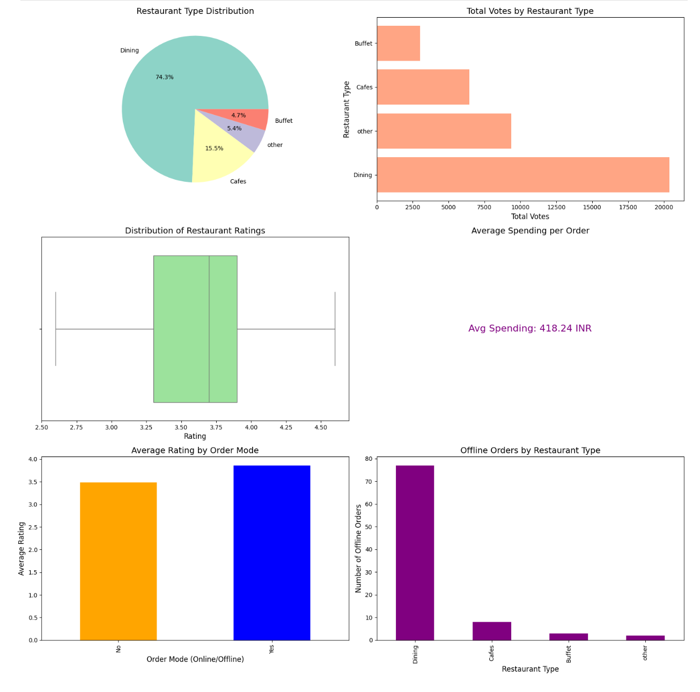

# Zomato Data Analysis Project

## Overview
This project involves performing comprehensive data analysis on the Zomato restaurant dataset to uncover insights about restaurant performance and customer preferences. The analysis covers various aspects, including restaurant types, customer votes, ratings, spending behavior, and online vs offline orders.

Key questions addressed:
- What type of restaurant do the majority of customers order from?
- How many votes has each type of restaurant received?
- What are the ratings that the majority of restaurants have received?
- What is the average spending of couples per order?
- Which mode (online or offline) has received the maximum rating?
- Which type of restaurant received more offline orders?

## Technologies Used
- **Python**
- **Pandas**
- **Matplotlib**
- **Seaborn**
- **Jupyter Notebook**

## Key Insights and Visualizations
- Visualized the most popular restaurant types (Buffet, Dining, etc.).
- Analyzed total votes by restaurant type and identified customer engagement trends.
- Examined restaurant ratings to identify patterns and outliers.
- Calculated average spending per couple, offering insights into customer spending behavior.
- Compared ratings for online vs offline orders, highlighting performance differences.
- Analyzed which restaurant types attract more offline orders.

## Screenshot

## Live Demo

[https://sandeep5647.github.io/Zomato-Data-Analysis/](https://sandeep5647.github.io/Zomato-Data-Analysis/)

